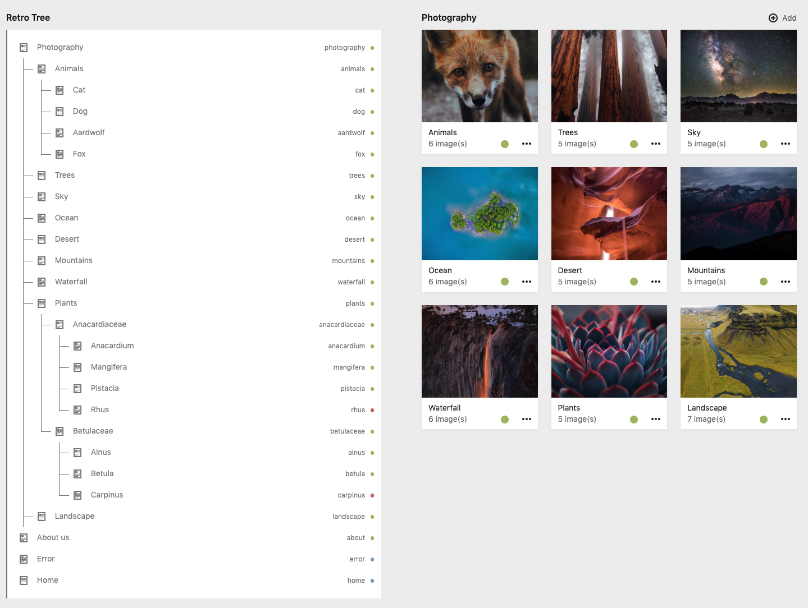
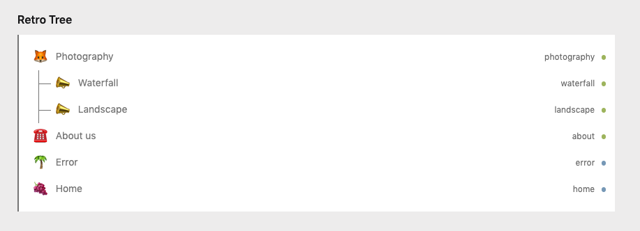

# Kirby 3 - Retrotree

Retrotree is a kirby 3 section plugin to display pages in real retro tree fashion.



## 1. Installation

composer require vitamin2/retrotree

or:

- Create a folder named "retrotree" in site/plugins
- Clone/Copy the repo of this repository into it

## 2. Blueprint usage

The `retrotree` section can replace any `pages` section you have already set:

```yaml
sections:
  retrotree:
    headline: Retro Tree
    type: retrotree
```

## 2.1 Blueprint optionals

You can also set optionals


```yaml
sections:
  retrotree:
    headline: Retro Tree
    type: retrotree

    treeMaxDepth: 5
    treeDefaultIcon: page
    treeEndMessage: no more entries
    showContent: site
    showStatus: true
    showSlug: true
    showPageIcon: false
```

## 2.2 optionals definition
Defines how many levels of subpages will be shown in the tree.

```yaml
treeMaxDepth: 5
```

Defines the default tree icon set. https://getkirby.com/docs/reference/plugins/ui/icon

- page
- add
- or any other icon from the kirby-ui-kit

```yaml
treeDefaultIcon: page
```

Message if no subpage is available:

```yaml
treeEndMessage: no more entries
```

Define which content is shown in the tree:

- site = display the complete $kirby->site in the tree
- page = display the current $page in the tree

```yaml
showContent: site
```

Shows page status in the tree:

```yaml
showStatus: true
```

Shows page slug in the tree:

```yaml
showSlug: true
```

Shows page icon in the tree, if any exists in the template. This will override the option "treeDefaultIcon"

```yaml
showPageIcon: true
```



## 3. Development

Follow step in the Kirby Docs.
https://getkirby.com/docs/guide/plugins/plugin-setup-panel

1. npm install -g parcel-bundler
2. yarn global add parcel-bundler
3. npm run dev
4. npm run build

## 4. License

MIT

Please visit our website if you like this Plugin [Vitamin2 AG](https://vitamin2.ch)

## 5. Credits

**Contributors:**

- [Marco Krapf - Vitamin2 AG](https://twitter.com/findthebug)
- [Ivan Pavlović - Vitamin2 AG](https://vitamin2.ch)
